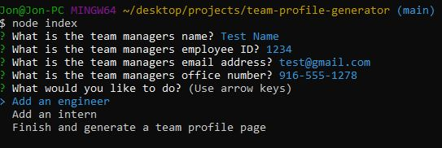

# Team Profile Generator

## Description

The team profile generator is a CLI tool that goes through a series of questions to build a team profile page. It asks for manager info, and then prompts for intern or engineer team members. It then ouputs the results into a styled HTML page.

## Table of Contents

- [Description](#description)
- [Installation](#installation)
- [Usage](#usage)
- [License](#license)
- [Contributing](#contributing)
- [Tests](#tests)

## Installation

- Make sure you have Node.js installed on your system
- Download a zip of the project files
- Unzip the files into a folder of your choice

## Usage

- Open a terminal window and navigate to the project folder
- Type 'npm i' to install all project dependencies
- Type 'node index' to run the tool.
- When done, your outputted HTML will be in the 'dist' folder

### Screenshot of CLI

### Screenshot of Output

## License

This project is covered under the [GNU General Public License v3.0](https://www.gnu.org/licenses/)

## Contributing

If you'd like to contribute, make a fork of the repository and make changes and then submit a pull request.

## Tests

This project used Jest to test objects and methods during the creation of the tool. If you'd like to run the tests:
- There is a tests folder if you want to view/update them
- Open a terminal window
- Type 'npm test' to run the tests

## Questions

View my [GitHub Page](https://github.com/UserName)

Send me an email @ [username@gmail.com](mailto:username@gmail.com)